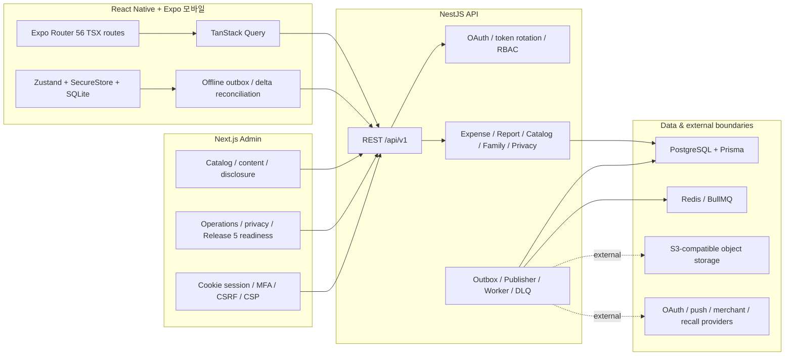

# WooriAI 전체 개발 현황 및 다음 개발 설계 기준선

- 작성 기준일: 2026-07-26 21:55 KST
- 대상 저장소: `F:\WooriAI`
- 문서 목적: 현재까지 구현된 전체 제품·기술 범위, 검증 수준, 미완료 경계, 현재 작업 중 변경을 한 문서에 고정하여 다음 개발 설계의 기준선으로 사용
- 현재 브랜치: `codex/sprint2-catalog-payments`
- 현재 HEAD: `7bc46213ea2ee9b17db4b8259ced8149378b2d74`
- HEAD 커밋: `docs: record current release evidence`
- 판정: **기능 범위가 넓은 로컬 통합 후보 / 현재 dirty source snapshot의 자동·Android 검증 완료 / 운영 출시 전 단계**

---

## 0. 이 문서를 읽는 방법

이 저장소에는 서로 다른 시점의 완료보고서, QA 증거, Android APK, Pixel Lock 결과가 함께 있다. 따라서 다음 네 상태를 섞지 않는다.

| 상태 | 의미 |
| --- | --- |
| 구현됨 | 코드·스키마·화면 또는 계약이 현재 작업 트리에 존재 |
| 현재 소스 검증 | 이 문서 작성 시점의 작업 트리 또는 동일한 소스 스냅샷에서 직접 다시 실행해 확인 |
| 과거 증거 | 이전 소스 스냅샷에서 통과했지만 현재 작업 트리와 정확히 같다고 볼 수 없음 |
| 외부 미검증 | 운영 계정, 실기기, 서명키, 외부 제공자, 스토어, 배포 환경이 없어 로컬에서 완료 판정할 수 없음 |

핵심 결론은 다음과 같다.

1. 제품의 핵심 루프, 모바일 앱, Nest API, Next Admin, PostgreSQL/Prisma 영속화, 오프라인 동기화, 카탈로그, 가족 권한, 개인정보 처리, Release 5 운영 도구까지 폭넓게 구현되어 있다.
2. 현재 작업 트리는 총 66개 경로가 변경되어 있다. 추적 파일 수정 49개, 미추적 17개이며 staged는 0개다. 이 문서를 제외한 65개 경로에는 가족 권한 원자성, 계정삭제 복구, 검증된 안전 대체품목, Today/알림 안전 lifecycle, Android build profile·provenance 강화가 함께 들어 있다.
3. 2026-07-26 현재 소스에서 전체 패키지 테스트는 8/8 패키지, 185개 파일, 1,030개 테스트가 통과했다.
4. 현재 소스에서 격리 catalog audit를 포함한 전체 Release Gate를 다시 실행해 16/16 PASS로 증거 파일을 갱신했다. install, dependency compatibility, secret/dependency audit, Prisma, isolated catalog audit, lint, typecheck, 전체 테스트, API E2E, Admin browser E2E, production build, strict peers가 모두 PASS다.
5. 현재 소스 스냅샷 `66AF...`에서 Pixel APK를 새로 빌드·설치했고, built/installed hash 일치와 Android Pixel Lock 9/9 PASS를 확인했다. 최악 점수는 `REP-001 = 0.047382`로 임계치 `0.0500` 안이다.
6. 같은 `66AF...` 소스 스냅샷의 정상 standalone APK와 설치된 `base.apk` SHA-256도 `98E43...`로 일치하며, fresh onboarding부터 안전 경고·알림·확인·일반 action snooze·재시작 복원까지 설치 앱 journey가 PASS했다. 다만 테스트 로그인·디버그 서명·임시 package/version이므로 스토어 후보는 아니다.
7. 정규 카탈로그는 구조상 409개까지 확장됐지만 마지막 측정에서 409개 전부 `in_review`, 게시 0개, 판매 오퍼 0개였다. 구조 완성과 운영 게시 준비를 분리해야 한다.

---

## 1. 현재 저장소 기준선

### 1.1 Git 상태

| 항목 | 현재 값 |
| --- | --- |
| 브랜치 | `codex/sprint2-catalog-payments` |
| HEAD | `7bc46213ea2ee9b17db4b8259ced8149378b2d74` |
| upstream 비교 | 0 behind / 0 ahead |
| 브랜치 커밋 수 | 90 |
| Git 추적 파일 수 | 2,193 |
| 전체 변경 경로 | 66 |
| 이 문서 제외 변경 경로 | 65 |
| 추적 파일 수정 | 49 |
| 미추적 경로 | 17 |
| staged | 0 |

`0 behind / 0 ahead`는 HEAD 커밋이 현재 설정된 upstream과 같다는 뜻이다. 아래 65개 로컬 변경 경로와 이 문서는 원격에 포함되지 않는다.

현재 tracked diff 규모:

- 49개 추적 파일
- `+2,893 / -463`
- 미추적 제품 소스·테스트·문서 17개

영역별 변경 경로:

| 영역 | 전체 | 추적 수정 | 미추적 |
| --- | ---: | ---: | ---: |
| `apps/admin` | 3 | 3 | 0 |
| `apps/api` | 26 | 19 | 7 |
| `apps/mobile` | 25 | 16 | 9 |
| `packages` | 2 | 2 | 0 |
| `scripts` | 7 | 7 | 0 |
| `docs` | 3 | 2 | 1 |

### 1.2 현재 작업 환경

| 도구 | 현재 값 |
| --- | --- |
| Node.js | `v25.2.1` |
| pnpm | `11.9.0` |
| npm | `11.6.2` |
| Git | `2.52.0.windows.1` |
| Android 대상 | `emulator-5554` |
| Android 모델 | `sdk_gphone64_x86_64` |
| Android 버전 | 15 |
| 화면 | 1080 × 2340 |
| density | 440 |

저장소의 `packageManager` 계약은 `pnpm@11.9.0`이다. 현재 pnpm은 이 계약과 일치한다.

### 1.3 현재 작업 트리 변경의 성격

현재 미커밋 변경은 단순 UI 조정이 아니다. 다음 다섯 영역을 동시에 건드린다.

1. 가족 소유권·구성원·초대·가족삭제의 동시성 및 감사로그 원자성
2. 계정삭제 7일 유예, 소유권 차단, 취소, 재시도, 접근철회 상태 전이
3. 리콜 품목의 검증된 안전 대체품목 근거·독립 검수·활성화·비활성화
4. 홈 Today Center, 안전 알림 inbox, 확인·snooze·재시작 복원을 잇는 사용자 lifecycle
5. 정상/Pixel/검증 fixture APK 간 환경 오염 방지와 provenance 분리

현재 dirty snapshot에 대한 로컬 검증은 완료됐지만 Git SHA로 고정된 릴리즈 단위는 아니다. 따라서 다음 개발에 들어가기 전에 이 변경을 하나의 명시적 Genesis Cycle 7 기준선으로 commit/PR화하는 것이 우선이다.

---

## 2. 제품 정의와 절대 보존 계약

### 2.1 제품 포지셔닝

WooriAI는 일반 가계부, 쇼핑몰, 커뮤니티가 아니다.

핵심 제품 정의:

> 아이에게 쓴 비용을 기록하고, 성장 시기와 상황에 맞는 준비물을 확인하며, 구매 이후 기록과 준비 상태까지 연결하는 가족 단위 생활 도구

고정 MVP 루프:

```text
지출 기록
  → 누적/기간별 총액 확인
  → 시기별 준비템 확인
  → 구매 링크 선택
  → 구매 후 지출 기록 또는 준비 상태 갱신
```

### 2.2 현재 고정된 하단 탭

현재 계약과 구현은 5개 탭이다.

1. 홈
2. 기록
3. 준비템
4. 리포트
5. 더보기

과거 문서 일부에는 4탭 또는 `프로필` 탭 표현이 남아 있지만, 현재 `AGENTS.md`, 현재 Expo Router 구현, 현재 Pixel Lock은 `더보기`를 포함한 5탭을 기준으로 한다.

### 2.3 변경 금지 핵심

- P0 화면 ID를 임의 변경하지 않는다.
- 추천 순위에 제휴 수수료율을 직접 반영하지 않는다.
- 구매 CTA 인접 위치의 제휴 고지를 숨기지 않는다.
- 스폰서 상품은 일반 추천과 구분한다.
- Excel/CSV 분석 결과를 사용자의 미리보기·확인 전에 지출로 저장하지 않는다.
- 지출 삭제는 soft delete와 audit log를 유지한다.
- 선물 지출은 기본 지출 합계에서 제외한다.
- 가족 역할 `owner / co_parent / viewer / gift_participant`와 권한 원칙을 유지한다.
- 금액은 0보다 큰 원화 정수다.
- 운영 secret, OAuth secret, 제휴 ID, 운영 DB URL을 소스에 넣지 않는다.
- 의료 효능을 단정하지 않는다.

---

## 3. 전체 시스템 구조



### 3.1 모노레포 패키지

| 경로 | 역할 | 주요 기술 |
| --- | --- | --- |
| `apps/mobile` | Android/iOS 모바일 앱 | React Native 0.76.9, Expo 52, Expo Router 4, React Query, Zustand |
| `apps/api` | 제품 API, 운영 API, worker/publisher | NestJS 11, Prisma 6, PostgreSQL, BullMQ, Redis |
| `apps/admin` | 내부 Admin CMS | Next.js 15, React 18 |
| `packages/domain` | 금액·날짜·단계·추천·온보딩 순수 규칙 | TypeScript |
| `packages/contracts` | Zod 기반 공유 API 계약 | Zod |
| `packages/ui` | 공유 UI 패키지 기반 | TypeScript |
| `packages/config` | 릴리즈 설정 계약 | TypeScript |
| `packages/test-utils` | release readiness, Pixel 정규화 등 검증 도구 | Vitest |
| `scripts` | 릴리즈, Android, DB, 카탈로그, Pixel, 증거 생성 | TypeScript/tsx |

### 3.2 현재 코드 규모 지표

| 지표 | 현재 수 |
| --- | ---: |
| 모바일 TSX 라우트 파일 | 56 |
| Admin TSX 화면/레이아웃 | 15 |
| API Nest 모듈 | 26 |
| API 컨트롤러 | 37 |
| API E2E 파일 | 30 |
| Prisma enum | 42 |
| Prisma model | 92 |
| Prisma migration | 41 |
| Mobile 테스트 파일 | 107 |
| API 테스트 파일 | 77 |
| Admin 테스트 파일 | 8 |

---

## 4. 개발 이력 요약

### 4.1 Batch 00~11: MVP 골격 완성

| Batch | 핵심 내용 | 현재 해석 |
| --- | --- | --- |
| 00 | Source Lock, Do Not Change 계약 | 제품·기술·화면 경계의 시작점 |
| 01 | pnpm monorepo, 앱·패키지 부트스트랩 | 현재 구조로 확장됨 |
| 02 | domain/contracts | 현재 API·모바일 공유 계약의 기반 |
| 03 | Prisma schema/seed | 이후 41개 migration, 92개 model로 확장 |
| 04 | API foundation, auth guard, RBAC, 오류 규격 | 현재 `/api/v1` 전반의 기반 |
| 05 | 인증·동의·온보딩 | 이후 Release 5U/5V 및 MOD_V1에서 강화 |
| 06 | 지출·예산·홈·리포트 | PostgreSQL 영속화·Report V2/V3·오프라인까지 확장 |
| 07 | 준비템·상품 링크·제휴 클릭 | canonical catalog/offer/review 구조로 확장 |
| 08 | 가족 초대·RBAC | 현재 Cycle 6 권한 원자성 작업으로 강화 중 |
| 09 | Excel/CSV import preview-confirm | 실제 CSV/XLSX 파싱, 중복/수식 방어까지 확장 |
| 10 | Admin CMS·설정·개인정보 | MFA/CSRF/CSP, privacy workflow로 확장 |
| 11 | QA·release gate·runbook | 현재 15단계 release gate와 Android 증거 체계로 확장 |

### 4.2 Round 4 / Round 5A

주요 발전:

- 전체 핵심 도메인을 Prisma/PostgreSQL 영속화
- refresh token hash 저장, 1회용 회전, 재사용 탐지 및 token family 무효화
- Admin email/password, TOTP MFA, HttpOnly cookie session, CSRF, CSP
- 실제 CSV/XLSX 파싱과 파일 선택
- 지출 낙관적 동시성 `version`
- 모바일 SQLite outbox, 충돌 표시, 재시도, delta sync
- 카카오 OIDC 어댑터·PKCE·state/nonce/replay 방어 구조
- CMS Draft → Review → Publish
- opaque affiliate redirect 및 클릭 기록
- analytics envelope와 PII 차단

### 4.3 제품 재설계 Sprint 0~2

#### Sprint 0

- 데모 fallback과 가짜 성공 상태 제거
- 홈·지출·준비템·리포트의 실제 query/mutation 중심 구조
- Pixel Lock 기준 화면과 Android 캡처 자동화 정비

#### Sprint 1

- 계정 프로필과 자녀 프로필 분리
- 다중 자녀 추가·수정·선택·전환
- 자녀 전환 시 홈·지출·준비템·리포트·예산 query 무효화
- 기존 단일 자녀 저장 데이터를 다중 자녀 구조로 승격
- 비로그인·자녀 미선택 딥링크 가드

#### Sprint 2

- 사용자 결제수단 CRUD, 기본값 1개, 비활성화 후 과거 지출 연결 보존
- 최근 90일 빠른 지출 프리셋
- 민감 카드·계좌 숫자열 입력 방어
- 자녀 성별 선택·직접입력·비우기
- 준비템 콘텐츠와 상품 링크 확대
- 카탈로그 validate/coverage/DB upgrade 검증

### 4.4 Release 3

- API main/publisher/worker 분리
- transactional outbox, retry/cancel, dedupe, DLQ
- remote config, notification preference, support/trust
- privacy export/deletion 상태 머신
- 구조화 로그, internal metrics, rate/MFA attempt limit
- Android AAB/APK 빌드 계약과 production config fail-closed

### 4.5 Release 4 / 4C~4I

- 24 domain / 120 category / 360 subcategory의 정규 카탈로그 구조
- canonical item, alias, lifecycle, context, source, safety, review, revision, approval 분리
- KST 서버 소유 리포트 기간과 Report V2/V3
- catalog import preview/apply/error CSV
- taxonomy 영향 미리보기·재정렬·archive
- catalog workflow queue, report resolution, link health
- notification, remote config, scheduler, publisher/worker 복구
- local staging parity와 실패 주입 검증

### 4.6 Release 5 / 5U / 5V

- legal/catalog/pilot readiness
- Today, preparation calendar, custom bundle, weekly briefing
- receipt 기반 보조 지출, 반복 지출 예측, 지출-품목 연결
- merchant feed, recall provider, safety alert
- onboarding draft scope·멱등·원자적 완료
- account/household/child scope 격리
- claim-to-source 증거 및 source snapshot
- production fixture contamination 방지

### 4.7 MOD_V1

- 현재 5탭 정보구조
- 공통 디자인 시스템과 48dp 터치 영역
- 3개 가시 단계 온보딩
- 기본 월 예산 500,000원
- Android native date picker
- HOME/기록/준비템/리포트/프로필·더보기 재정비
- 큰 글꼴, TalkBack bound-service/focus smoke
- 준비템 상품명 대신 카테고리명 중심 표현

### 4.8 2026-07-25 통합 하드닝

커밋된 최신 기준선의 주요 내용:

- Node/pnpm/CI/release gate 및 테스트 파티션 하드닝
- Android 빌드 source snapshot과 native branding 검증
- 준비템 HTML parity와 grouping
- Admin catalog/operations 강화
- 모바일 first-render 모듈 경계 단순화
- SQLite offline store, delta reconciliation, sync continuation
- purchase follow-up 상태 저장과 제휴 링크 orchestration
- 로그아웃 시 세션·저장소·구매 상태 정리
- 앱 아이콘·스플래시·성장 단계 이미지 정비

### 4.9 현재 미커밋 Cycle 5·6 및 Genesis Cycle 7

현재 작업 중인 변화:

- Cycle 5: 검증된 안전 대체품목과 공개 근거 URL 정책
- Cycle 6: 가족 권한 lifecycle 원자성, 계정삭제 차단·취소·재시도, fixture/normal APK 분리
- Genesis Cycle 7: 안전 경고를 홈 Today Center, 알림 inbox, 준비템 context, 확인 상태와 연결하고 일반 recurring/replacement action의 snooze 및 재시작 복원을 완성

이 부분은 아래 14장에서 상세히 다룬다. 현재 dirty source snapshot `66AF...` 기준으로 Release Gate 15/15, standalone 설치 journey, Pixel Lock 9/9까지 통합 검증됐다.

---

## 5. 모바일 앱 상세 현황

### 5.1 라우팅과 화면

현재 `apps/mobile/app`에는 56개 TSX 라우트가 있다.

주요 그룹:

- 인증: 로그인, Kakao callback
- 온보딩: 상태 선택, 임신/출생/직접 단계, 자녀 프로필, 준비물, 예산, review, resume
- 5탭: 홈, 기록, 준비템, 리포트, 더보기
- 자녀: 목록, 추가, 수정
- 지출: 신규, 상세 수정
- 준비템: 목록, 상세, 달력, custom bundle
- 가족: 구성원, 초대, 초대 수락
- Excel/CSV: 업로드, 분석/미리보기
- 설정: 프로필, 알림, 개인정보, 동기화 상태
- Release 5: 영수증 입력, weekly briefing, report source
- Pixel Lock: deterministic fixture screen

### 5.2 인증·세션

구현:

- SecureStore 기반 access/refresh token 저장
- 기존 AsyncStorage token의 1회 migration
- single-flight token refresh
- refresh 응답 손실·재시도와 세션 scope 방어
- logout 시 token, selected child, query cache, 로컬 fixture, 구매 follow-up 상태 정리
- standalone 테스트 로그인과 실제 세션의 명시적 분리
- 프로덕션 빌드에서 test login/fixture가 켜지지 않도록 경계 테스트

현재 외부 경계:

- 실제 Kakao 콘솔·운영 키·실 사용자 end-to-end는 미검증
- Apple 로그인은 실제 provider/native/server 구현이 없어 성공으로 표시하지 않음
- Google 로그인도 운영 자격증명과 runtime 검증 없음

### 5.3 온보딩

구현:

- 임신, 출생, 직접 단계 선택
- KST date-only 규칙
- scoped onboarding draft v3
- 사용자/가족 scope 변경 시 오래된 draft 차단
- 준비물 상태 `SELECTED / SKIPPED / COMPLETED_NONE` 구분
- 기본 월 예산 500,000원
- 3개 가시 단계 UX
- 마지막 제출 시 멱등키 고정, single-flight, atomic API completion
- 완료 전 자녀/profile을 미리 생성하지 않는 계약
- 재시작 후 현재 단계 복원
- 자녀 선택과 query cache 갱신

검증:

- domain/mobile/API 계약 테스트
- Android 설치 앱 온보딩 walkthrough 증거
- native date picker 사용

남은 외부 검증:

- 실제 운영 OAuth 이후 온보딩
- 저사양 실기기
- 전체 TalkBack 순차 탐색과 한국어 음성 청취 품질

### 5.4 홈

구현:

- 선택된 자녀 요약
- 월 예산, 사용액, 잔액
- 빠른 기록 진입
- 최근 지출
- 준비템 추천·진행 상태
- 동기화 상태
- 자녀 전환 및 계정/프로필 진입
- loading/empty/error/offline 상태

데이터 경계:

- 실제 세션은 API query
- standalone 내부 검증은 명시적 fixture backend
- 프로덕션에서 fixture 데이터 사용을 차단하는 테스트 존재

### 5.5 지출·예산·결제수단

구현:

- 수동 지출 생성·조회·수정·soft delete
- positive KRW integer
- 미래 날짜 차단
- gift/refund/support 분리
- 결제수단 선택과 사용자별 기본값
- 과거 지출의 비활성 결제수단 연결 보존
- 최근 90일 빠른 지출 프리셋
- 빠른 지출에서 과거 금액 자동 복사 금지
- Idempotency-Key
- optimistic concurrency `version`
- 오프라인 생성·수정·삭제 큐
- 충돌 후 서버/로컬 선택과 재조정

검증:

- DB transaction rollback
- 동일 idempotency key 동시 요청
- version conflict
- create/update/delete 후 홈·리포트 합계 일치
- gift 제외

### 5.6 오프라인 및 동기화

구현:

- SQLite 기반 오프라인 저장소
- memory fallback
- outbox merge
- single-flight flush
- flush 중 추가 mutation의 후속 drain
- delta pull runner
- tombstone/변경 reconciliation
- legacy schema upgrade와 실패 시 rollback
- account/household/child scope 격리
- pending/syncing/offline/conflict/synced 표시
- 세션 전환 시 오래된 delta와 query 차단

남은 검증:

- 실제 느린 네트워크·장시간 offline·대용량 사용자 데이터
- 운영 API와의 다중 기기 수렴
- 물리기기 process death 중 SQLite/네트워크 복구

### 5.7 준비템·추천·구매 후속

구현:

- 자녀 단계·산모 단계·context 기반 준비템
- 맞춤/전체/내 준비함
- 상태 변경 및 query invalidation
- 필요 이유, 안 사도 되는 경우, 안전 주의, 중고/대여 정책
- product link와 sponsored/affiliate 표시
- 제휴 click 기록
- opaque redirect
- 구매 후 지출 또는 준비 상태 연결
- purchase follow-up store와 session boundary
- commission-independent ranking

현재 주의:

- canonical 필요품목과 판매 가능한 product offer는 별도 모델이다.
- 제품이 필요하다는 판단과 구매 링크가 있다는 사실을 동일시하면 안 된다.
- published-only/fail-closed 정책을 유지해야 한다.

### 5.8 가족

구현:

- 구성원 목록
- 역할별 초대
- 초대 preview/accept
- owner-only 초대 생성
- co-parent 지출 작성
- viewer 읽기 전용
- gift participant 제한
- 구성원 제거
- 소유권 이전
- 가족 나가기
- 가족 삭제

현재 Cycle 6 강화:

- 동시 소유권 이전/구성원 제거/나가기/초대 수락/가족 삭제 충돌 직렬화
- 소유자가 남지 않는 상태 방지
- archive된 가족에 구성원이 활성화되는 상태 방지
- 권한 변경과 감사로그를 같은 transaction으로 묶음
- 정확한 blocking household로 이동
- stale target을 명확한 오류 코드로 처리

### 5.9 Excel/CSV 가져오기

구현:

- expo-document-picker
- multipart 업로드
- CSV/XLSX 파싱
- CP949 처리
- 10MB/2,000행 제한
- formula injection 방어
- duplicate 후보
- confidence 기반 기본 선택
- row 수정/선택
- preview-before-save
- confirm 시에만 expense 생성
- 오류 CSV

남은 범위:

- 운영 object storage
- 실제 대용량/악성 파일 부하 테스트
- Excel export 제품 기능

### 5.10 알림·주간 브리핑·보조 기능

구현:

- notification preference
- marketing opt-in timestamp
- device token 계약
- notification delivery/attempt 모델
- critical safety notification과 일반 알림의 중요도·아이콘·테두리 구분
- 알림 category/navigation metadata를 이용한 정확한 child/item/preparation context 이동
- Today action
- 안전 확인 action은 숨기거나 snooze할 수 없도록 고정
- 일반 due/replacement/recurring action은 다음 날까지 snooze
- optimistic response와 authoritative server response의 version 비교
- 앱 재시작 후 acknowledgement·snooze·replacement 상태 복원
- preparation calendar
- custom bundle
- weekly briefing
- receipt draft/confirmation
- report source
- support reason code

외부 경계:

- 실제 FCM/APNs provider
- 운영 스케줄러
- 실제 수신·딥링크·알림 권한 실기기 검증

---

## 6. API 상세 현황

### 6.1 API 기본

- Base path: `/api/v1`
- NestJS 11
- DTO validation
- 공통 오류 envelope
- request ID 및 구조화 로그
- body size 제한
- security headers
- rate limit
- idempotency interceptor
- auth/role guard

### 6.2 현재 모듈

26개 Nest 모듈:

- admin
- analytics
- app-config
- auth
- catalog-v2
- audit
- object storage
- finance
- health
- households
- imports
- items-commerce
- jobs
- legal
- metrics
- notifications
- onboarding
- presets
- prisma
- privacy
- release5
- settings
- sync
- trust
- app root

### 6.3 인증과 보안

구현:

- OAuth identity 정규화
- Kakao provider adapter
- PKCE/state/nonce/replay 방어
- refresh token hash 저장
- rotation과 reuse detection
- concurrent refresh CAS
- production dev-auth 차단
- Admin password + TOTP MFA
- recovery code
- cookie session
- CSRF
- nonce CSP와 `frame-ancestors 'none'`
- SSRF/private IP/redirect 방어
- 공개 HTTPS URL 정책

현재 Cycle 5의 공개 URL 정책은 다음을 차단한다.

- HTTP
- loopback
- private IPv4
- link-local
- private/reserved IPv6
- userinfo
- 비표준 공개 근거 경로
- 파싱 불가능 URL

모바일은 서버가 준 URL을 열기 직전 다시 검증한다.

### 6.4 지출·리포트

구현:

- expense CRUD
- soft delete + audit
- version concurrency
- budget
- monthly/cumulative/category/yearly report
- KST 기간
- report maturity
- source traceability
- payer/gift/refund/support 분리
- aggregate 모델

### 6.5 Worker와 운영

구현:

- transactional `job_outbox`
- 별도 publisher/worker entry
- BullMQ/Redis 경계
- dedupe
- retry/cancel
- lease recovery
- dead letter queue
- processed job
- schedule handler
- provider acknowledgement loss reconciliation

외부 경계:

- 운영 Redis
- 운영 worker scale
- 실제 provider
- 장애 대시보드와 alert

---

## 7. Admin CMS 상세 현황

### 7.1 현재 화면

15개 TSX 화면/레이아웃:

- dashboard
- catalog
- items
- links
- disclosures
- clicks
- operations
- privacy
- account deletion
- data export
- legal terms
- support
- reviews
- Release 5 readiness

### 7.2 보안

구현:

- client-held Bearer/localStorage token 사용 금지
- cookie session
- password 1단계 + TOTP/recovery code 2단계
- MFA setup QR/manual key
- recovery code 1회 표시
- CSRF header
- 401 시 session clear 및 로그인 이동
- same-origin `/api/v1` proxy
- CSP nonce
- X-Frame-Options
- X-Content-Type-Options

### 7.3 카탈로그 운영

구현:

- item template 생성/수정
- product link 생성/수정
- disclosure 관리
- affiliate click summary
- canonical item review/publish workflow
- revision/approval/history
- rollback은 새 draft revision으로만 수행
- taxonomy tree, archive 영향 preview, exact-sibling reorder
- 구조/coverage/operations queue
- bounded JSON/CSV/XLSX import preview/apply
- 오류 CSV
- 신고 batch 해결
- 지원되는 link health retry

### 7.4 Release 5 readiness console

구현:

- legal candidate preview
- evidence source 생성
- 독립 evidence 검수
- pilot worklist/manifest preview
- recall worklist
- merchant feed preview
- 안전 대체품목 비활성 mapping
- 독립 검수 후 세 번째 담당자 활성화
- 즉시 비활성화

중요:

- Admin 화면에 버튼이 있다는 이유만으로 운영 publish가 완료된 것은 아니다.
- 현재는 fail-closed 운영 준비 도구이며, 실제 사람의 승인·법무·외부 provider가 필요하다.

---

## 8. 데이터베이스와 도메인 모델

### 8.1 현재 스키마 규모

| 항목 | 수 |
| --- | ---: |
| migration | 41 |
| enum | 42 |
| model | 92 |

### 8.2 주요 도메인 그룹

#### 사용자·인증

- User
- OAuthIdentity
- RefreshToken
- UserDevice
- AdminUser
- AdminSession
- OauthTransaction

#### 가족·자녀

- Household
- HouseholdMember
- HouseholdInvite
- Child
- MotherProfile
- PreparationContextProfile

#### 회계

- Expense
- Budget
- UserPaymentMethod
- QuickExpensePreset
- ExpenseCategoryV2
- ReportDailyAggregate
- ReceiptDraft
- ReceiptConfirmation
- ExpensePlanLinkEvent

#### 준비템·카탈로그

- ItemTemplate
- ItemTemplateStage
- ChildItemStatus
- ItemDefinition
- CatalogNode
- ItemDefinitionCategory
- ItemLifecycleRule
- ItemContextRule
- ItemAttribute
- ItemEvidenceSource
- ItemSafetyRule
- ItemAlternative
- ItemDependency
- ItemBundle
- ItemBundleMember
- ItemSynonym
- CatalogItemRevision
- CatalogItemApproval
- CatalogItemWorkflowEvent
- CatalogCoverageDecision
- CatalogItemReport

#### 커머스

- ProductLink
- ProductOffer
- ProductLinkHealth
- AffiliateClick
- MerchantFeedImport
- MerchantFeedRow
- RecallProviderEvent

#### 사용자 준비 상태

- UserItemPlan
- UserItemPlanHistory
- UserItemPlanComment
- CustomPreparationBundle
- CustomPreparationBundleItem
- CustomBundleApplication

#### Import

- ImportJob
- ImportRow
- CatalogImport

#### 개인정보·법무·감사

- Consent
- LegalDocument
- ConsentEvent
- PrivacyRequest
- PrivacyRequestEvent
- Attachment
- AuditLog
- ContentRevision

#### 운영

- JobOutbox
- DeadLetterJob
- ProcessedJob
- NotificationPreference
- NotificationDelivery
- NotificationDeliveryAttempt
- RemoteConfig
- RemoteConfigRevision
- ServiceInstanceHeartbeat
- SupportReport
- ReportIntegrityCheck
- AnalyticsEvent

### 8.3 반드시 분리해야 하는 네 데이터 계층

다음은 이름이 비슷하지만 설계상 서로 다른 개념이다.

| 계층 | 의미 | 대표 모델 |
| --- | --- | --- |
| 기존 앱 준비템 | 화면·legacy 호환 중심 template | `ItemTemplate`, `ProductLink` |
| 정규 필요품목 카탈로그 | 생활 필요성과 근거 중심 canonical item | `ItemDefinition`, lifecycle/context/evidence |
| 판매 오퍼 | 실제 판매처·재고·리콜·승인 | `ProductOffer`, `MerchantFeed*` |
| 사용자 준비 상태 | 특정 가족/아이의 계획과 상태 | `UserItemPlan`, `ChildItemStatus` |

다음 개발에서 이 네 계층을 하나의 `item` 테이블이나 DTO로 다시 합치면 안 된다.

---

## 9. 카탈로그 현재 상태

### 9.1 현재 정규 카탈로그 감사

2026-07-26에 41개 migration과 현재 seed를 적용한 전용 fresh DB `wooriai_release4_fresh_verify`를 명시해 `pnpm catalog:audit`를 다시 실행했다. API 테스트 데이터가 남은 공유 `wooriai_test`의 임시 감사 결과는 폐기했으며, fresh DB 감사 후 전용 검증 DB를 제거했다.

| 항목 | 현재 측정 |
| --- | ---: |
| domain | 24 |
| category | 120 |
| subcategory | 360 |
| canonical item | 409 |
| alias | 3,287 |
| high-risk item | 85 |
| context rule | 495 |
| distinct context | 25 |
| item status | `in_review` 409 |
| published | 0 |
| product offer | 0 |
| coverage covered | 364 |
| coverage gap | 1,460 |
| external review blocker | 1,460 |

판정:

- 구조 완전성: PASS
- scenario personalization 구조: PASS
- published content readiness: FAIL
- 운영 노출: fail-closed 유지

### 9.2 현재 제품 설계에 주는 의미

- “409개 준비템 구현”은 “409개 운영 추천 게시”가 아니다.
- 85개 high-risk 품목은 전문 검수와 독립 승인 없이 노출하면 안 된다.
- 판매 오퍼 0개이므로 canonical 필요품목과 실제 구매 가능성을 분리해서 UX를 설계해야 한다.
- 게시 가능한 콘텐츠가 부족하면 앱은 fixture나 `in_review` 데이터를 운영 사용자에게 보여주는 대신 정직한 빈 상태를 보여야 한다.
- 현재 감사는 재생성됐지만 coverage gap 1,460개와 외부 검수 blocker 1,460개가 남아 있다.

---

## 10. 디자인 시스템과 접근성

### 10.1 현재 코드의 실사용 토큰

현재 코드:

- Primary: `#C94627`
- Canvas/background: `#FFFDFC`
- Text primary: `#211E1C`
- 공통 spacing/radius/type/motion token
- chart palette 별도

### 10.2 문서 계약 충돌 해소

2026-07-26에 현재 코드·native branding·Pixel reference를 `MOD_V1 / native-v1.0` canonical로 승인했다.

- Primary: `#C94627`
- Secondary: `#267A68`
- Canvas/background: `#FFFDFC`
- Text primary: `#211E1C`
- `docs/dev/source-lock.md`와 `docs/dev/do-not-change.md` 갱신 완료
- 과거 `#FF8A7A / #FFF8F1 / #242424`는 legacy migration 기록으로만 유지
- Admin 홈의 남은 legacy canvas/text literal도 canonical 값으로 교체
- 문서·Admin·모바일 semantic token 일치를 focused test로 고정

### 10.3 접근성 구현

구현:

- 48dp 중심 touch target
- accessibility role/label/state
- expanded/collapsed 상태
- live region
- alert
- chart와 접근성 데이터 표의 동일 source
- font scale 1.5 대응
- reduce motion 경계
- 320~840dp source contract
- TalkBack bound-service/focus smoke

남은 검증:

- 한국어 발화 인간 청취
- 전체 화면 순차 탐색
- 실제 노치/펀치홀
- 물리기기 320/480/840dp 대표 화면
- 다크모드 강제 상태의 의도된 처리

---

## 11. 보안·개인정보 현황

### 11.1 구현된 보안

- 운영 secret fail-fast
- dev auth production 차단
- password/MFA rate limit
- refresh token rotation/reuse family revoke
- cookie/CSRF/CSP Admin
- request body limit
- secret scan
- production dependency audit
- SSRF/private IP/redirect 차단
- URL scheme/공개 HTTPS 검증
- CSV formula injection 방어
- PII analytics envelope 차단
- 구조화 로그 redaction
- forbidden mobile storage/permission audit
- `allowBackup=false`
- cleartext traffic 차단

### 11.2 개인정보 기능

구현:

- versioned legal docs
- append-only consent event
- export request
- deletion request
- 7일 grace
- grace 중 cancel
- 기한 후 접근철회
- processor queue/purge/retained exception/completed/failed 상태
- 현재 삭제 요청 조회
- public status token 경계
- Release 5 데이터셋 export/delete disposition

현재 Cycle 6:

- 소유 중인 가족이 남아 있으면 삭제를 fail-closed
- 어느 가족이 차단하는지 반환
- 접근을 철회하지 않은 채 `failed / OWNER_TRANSFER_REQUIRED`
- 소유권 이전 후 즉시 retry
- 차단 상태에서도 cancel
- 처리 단계에서는 cancel과 신규 삭제 버튼 숨김

### 11.3 법무·운영 외부 경계

- 개인정보 처리방침 실 사업자 정보
- 아동/가족 데이터 정책 승인
- 제휴/스폰서 고지 법무 승인
- 의료·안전 문구 전문 검수
- 실제 export 보관·암호화·삭제 processor
- 운영 데이터 보존 예외 승인

---

## 12. 테스트와 품질 게이트

### 12.1 현재 소스에서 실행한 전체 테스트

실행:

```powershell
pnpm test --concurrency=1 --force
```

결과:

| 패키지 | 파일 | 테스트 | 결과 |
| --- | ---: | ---: | --- |
| admin | 8 | 36 | PASS |
| @wooriai/ui | 1 | 1 | PASS |
| @wooriai/config | 1 | 3 | PASS |
| @wooriai/test-utils | 3 | 26 | PASS |
| @wooriai/domain | 12 | 78 | PASS |
| @wooriai/contracts | 5 | 41 | PASS |
| mobile | 107 | 614 | PASS |
| api | 48 | 231 | PASS |
| 합계 | 185 | 1,030 | PASS |

검증 해석:

- Release Gate 안에서 `pnpm test --concurrency=1 --force`를 실행해 PASS
- Gate 기록상 전체 테스트 단계 약 2분 23초
- 직후 동일 source hash의 Turbo cache replay에서도 같은 185개 파일/1,030개 테스트 PASS 확인
- 8/8 패키지 성공

### 12.2 현재 소스의 가족 권한 집중 DB 테스트

실행:

```powershell
pnpm --filter api exec vitest run --config vitest.e2e.config.mts test/household-authority-lifecycle.db.test.ts
```

결과:

- 1 file
- 10 tests
- PASS
- PostgreSQL `wooriai_test`
- 41 migrations, pending migration 0

검증된 동시성:

- transfer vs remove
- transfer vs leave
- delete vs invite accept
- invite create vs delete
- privacy activation vs invite accept
- privacy activation vs ownership transfer
- privacy activation vs household delete
- 감사로그 실패 시 권한 변경 rollback

### 12.3 현재 소스의 안전 대체품목 테스트

전체 API 테스트에 포함되어 실행됨:

- `release5-safety-alternatives.db.test.ts`
- 19 tests
- PASS

검증:

- 근거 캡처자와 검수자 분리
- 세 번째 활성화 담당자
- exact alternative claim
- review due/expiry
- stale evidence fail-closed
- 동시 approve/reject 단일 winner
- mapping transaction + audit rollback
- role/household privacy
- serialization retry

### 12.4 저장된 최신 전체 Release Gate

증거 파일:

- `docs/qa/evidence/latest-release-gate.json`
- `docs/qa/evidence/latest-release-gate.md`
- 생성: `2026-07-26T10:53:52Z` = 2026-07-26 19:53 KST

결과:

| Gate | 저장된 결과 |
| --- | --- |
| install | PASS |
| mobile dependency compatibility | PASS |
| env example | PASS |
| secret scan | PASS |
| production dependency audit | PASS |
| Prisma validate/generate | PASS |
| DB start | PASS |
| lint | PASS |
| typecheck | PASS |
| all tests | PASS |
| API E2E | PASS |
| Admin browser E2E | PASS |
| production build | PASS |
| strict peers | PASS |

현재 해석:

- 현재 dirty source snapshot에서 전체 15단계 Gate가 PASS다.
- test 단계는 `--force`로 실행되어 8/8 패키지, 185개 파일, 1,030개 테스트가 통과했다.
- API E2E와 Admin browser E2E도 같은 Gate 실행에서 통과했다.
- 이는 로컬 통합 후보 증거이며, clean commit/CI, production 배포, 실제 OAuth, store signing, backup restore, closed beta 안정성을 증명하지는 않는다.

### 12.5 현재 품질 상태 요약

| 범위 | 상태 |
| --- | --- |
| current unit/integration package tests | PASS |
| current authority concurrency focused DB | PASS |
| current API E2E | PASS |
| current Admin browser E2E | PASS |
| current full release gate | 15/15 PASS |
| current exact-source Android Pixel 9-screen | 9/9 PASS |

---

## 13. Android·APK·Pixel Lock 현황

### 13.1 APK 보관 규칙

모든 최종 APK는 프로젝트 루트 `F:\WooriAI`에 둔다.

`artifacts`에는 다음만 둔다.

- JSON/Markdown report
- adb screenshot
- diff/heatmap
- UIAutomator XML
- logcat
- provenance

### 13.2 현재 정상 standalone APK

| 항목 | 값 |
| --- | --- |
| APK | `wooriai-0.0.0-release-standalone.apk` |
| SHA-256 | `98E43EEF980F98CFFAB51372019958375CCE9B04F97DE6E3F52FBB979B86794F` |
| bytes | 79,551,462 |
| source snapshot | `66AF661F1B6364CB60D198ACC74201F52421C9C98064039DA5CAD9E90F49CCCC` |
| source files | 960 |
| native explicit files | 75 |
| source verification | `VERIFIED_STABLE` |
| generated/embedded bundle | `36918F38EF052CBBF877575C9DA74FF392E3E174460BB8E82C2A3A138605193C` 일치 |
| package | `com.anonymous.wooriai` |
| version | `0.0.0` |
| versionCode | 1 |
| signing | debug-internal-only |
| ABIs | armeabi-v7a, arm64-v8a, x86, x86_64 |
| test login | enabled |
| Pixel fixture | disabled |
| authority fixture | disabled |
| safety fixture | disabled |

설치 검증:

- built APK와 installed `base.apk` SHA-256 일치
- fresh onboarding으로 `Cycle7` 자녀 생성
- 홈의 안전 경고 노출
- critical inbox 알림 `Cycle7 · 기저귀 공식 안전 안내`
- 알림에서 `아이 · Cycle7` context와 `리콜 알림 · 기저귀`를 정확히 선택
- acknowledgement 후 홈 안전 경고 제거
- 일반 recurring action은 `내일까지 미뤘어요.` 결과 확인
- 앱 재시작 후 안전 경고와 snooze 대상은 계속 숨김, replacement action은 유지
- fatal log match 0

판정:

- 현재 `66AF...` 소스 정상 standalone 내부 검증: PASS
- production/store: NOT QUALIFIED

### 13.3 현재 authority recovery fixture APK

| 항목 | 값 |
| --- | --- |
| APK | `wooriai-0.0.0-release-standalone-authority-8b70...apk` |
| SHA-256 | `8B70CD18C94843389965A2C84346CF763EE7663696777501A61349604FA0E86B` |
| source snapshot | 이전 Cycle 6 전용 `AEBE...` |
| authority fixture | enabled |
| safety fixture | disabled |
| built/installed hash | 일치 |

설치 journey:

- owner leave guard
- blocked account deletion
- blocked request cancel
- exact blocking household 이동
- ownership transfer
- retry
- immediate processing
- processing 상태에서 cancel/신규 삭제 액션 숨김

판정:

- deterministic 내부 fixture runtime: PASS
- 운영 동작 증거: 아님

### 13.4 현재 exact-source Pixel APK

| 항목 | 값 |
| --- | --- |
| APK | `wooriai-pixel-63f321...apk` |
| SHA-256 | `63F32119D2C7753B7A7A665641CE9BA743FC4F2B3A7D8E2796EE233A772AAC6A` |
| installed base SHA-256 | built hash와 일치 |
| source snapshot | `66AF661F1B6364CB60D198ACC74201F52421C9C98064039DA5CAD9E90F49CCCC` |
| source verification | `VERIFIED_STABLE` |
| profile | pixel-lock |
| Pixel fixture | enabled |
| authority/safety fixture | disabled |
| build | PASS |
| full screen gate | 9/9 PASS |

중요:

- standalone과 Pixel APK는 같은 `66AF...` source snapshot을 공유한다.
- `PIXEL_ANDROID_OVERRIDES` 없이 빌드·설치·캡처했다.
- built APK와 설치된 `base.apk` 해시가 일치한다.

### 13.5 최신 완료 Pixel Lock

완료 증거:

- 생성: 2026-07-26 20:44 KST
- source snapshot: `66AF661F1B6364CB60D198ACC74201F52421C9C98064039DA5CAD9E90F49CCCC`
- Pixel APK SHA-256: `63F32119D2C7753B7A7A665641CE9BA743FC4F2B3A7D8E2796EE233A772AAC6A`
- installed `base.apk` hash: built hash와 일치
- Android 15, 1080×2340, density 440
- adb `screencap` + pull
- threshold: `<= 0.0500`

| 화면 | 점수 | 결과 |
| --- | ---: | --- |
| SPL-001 | 0.029517 | PASS |
| HOME-001 | 0.038868 | PASS |
| EXP-001 | 0.000000 | PASS |
| ITEM-001 | 0.017230 | PASS |
| ITEM-002 | 0.044262 | PASS |
| REP-001 | 0.047382 | PASS |
| FAM-001 | 0.038233 | PASS |
| IMP-003 | 0.044157 | PASS |
| SET-001 | 0.014230 | PASS |

판정:

- 9/9 PASS
- worst: `REP-001 = 0.047382`
- 모든 화면 render valid
- 새로운 통과 목표 `<= 0.0480`도 모든 화면 충족

정확한 현재 상태:

> standalone 설치 journey, Release Gate 15/15, Android Pixel Lock 9/9는 모두 동일한 현재 source snapshot `66AF...`에 묶여 있다. 다만 이 snapshot은 dirty working tree 기준이므로 clean commit SHA/CI/운영 배포 증거와는 구분한다.

### 13.6 스토어 후보가 아닌 이유

- package가 `com.anonymous.wooriai`
- version `0.0.0`
- versionCode 1
- Android Debug certificate
- test login 포함
- 운영 API URL/실 OAuth 미검증
- production signing 없음
- Play internal track 없음
- 물리기기 없음
- iOS 빌드 없음

---

## 14. 현재 미커밋 Cycle 5·6 및 Genesis Cycle 7 상세

### 14.1 가족 권한 transaction

주요 파일:

- `apps/api/src/common/authorization/plan-reader.ts`
- `apps/api/src/households/authority-transaction.ts`
- `apps/api/src/households/household-runtime.service.ts`
- `apps/api/src/households/households.controller.ts`
- `apps/api/test/household-authority-lifecycle.db.test.ts`

핵심 설계:

- user row와 household row를 정렬해 lock
- operation-specific member/invite row 추가 lock
- 현재 active user/household/owner를 transaction 안에서 재검증
- mutation과 audit log를 한 transaction으로 기록
- audit log 실패 시 mutation rollback
- 소유권 version 증가
- owner member와 household ownerUserId 동시 변경
- 삭제 시 pending invite expire
- 초대 수락 시 만료시간과 pending 상태를 CAS

방지하는 결함:

- transfer 직후 이전 owner가 owner로 남음
- remove와 transfer race에서 owner 없음
- archive된 household에 invite accept
- privacy access revoke 직전 새 owner 승격
- audit는 실패했는데 실제 권한만 바뀜

### 14.2 계정삭제 복구

주요 파일:

- `apps/api/src/privacy/privacy-state.ts`
- `apps/api/src/privacy/privacy.service.ts`
- `apps/api/src/privacy/privacy.controller.ts`
- `apps/mobile/src/privacy/account-deletion-presentation.ts`
- `apps/mobile/app/settings/privacy.tsx`
- `apps/mobile/src/authority-recovery.test.ts`

상태:

```text
requested
  → access_revoked
  → processor_delete_queued
  → purging
  → completed | retained_exception

requested/processing
  → failed

requested(grace) 또는 owner-blocked failed
  → cancelled

owner-blocked failed
  → requested(retry)
```

UX 규칙:

- 차단 상태: 삭제가 시작되지 않았고 접근도 유지됨을 명시
- blocking household로 이동
- owner transfer 후 재시도
- 유예 또는 차단 상태에서만 취소
- 즉시 처리 단계에서는 취소·신규 삭제 액션 숨김

### 14.3 검증된 안전 대체품목

주요 파일:

- `apps/api/src/release5/item-evidence-policy.ts`
- `apps/api/src/release5/release5-external.service.ts`
- `apps/api/src/release5/release5-readiness.service.ts`
- `apps/api/src/common/security/public-https-url.ts`
- `apps/api/test/release5-safety-alternatives.db.test.ts`
- `apps/admin/app/release5/page.tsx`
- `apps/mobile/src/preparation/PreparationOverview.tsx`
- `apps/mobile/src/preparation/safety-query-scope.ts`
- `apps/mobile/src/security/public-evidence-url.ts`

승인 분리:

1. editor/admin A가 evidence 캡처
2. 다른 admin B가 content hash를 확인하고 독립 검수
3. 다른 admin C가 exact alternative claim을 확인하고 mapping 활성화

fail-closed 조건:

- published item 아님
- evidence 없음
- source revision 불일치
- capturer 없음
- self-review
- expired
- review due
- public HTTPS URL 불안전
- exact alternative claim 없음
- mapping이 stale/replaced

모바일:

- 리콜과 provider recall을 리콜 알림으로 표시
- provider correction은 정정 안내로 표시
- correction에는 대체품목 CTA를 노출하지 않음
- 검증된 대체품목 펼침/접힘
- 근거 제목·안전 메모·공개 URL
- account/household/context를 포함한 query key
- scope가 바뀌면 선택된 alert와 cache 무효화

### 14.4 fixture 오염 방지

추가된 환경:

- `EXPO_PUBLIC_AUTHORITY_RECOVERY_FIXTURE`
- `EXPO_PUBLIC_SAFETY_ALTERNATIVE_FIXTURE`

정책:

- standalone profile에서 명시적으로 `1`인 경우만 활성화
- release gate는 둘 다 `0`
- Pixel build는 둘 다 `0`
- build report에 실제 env 기록
- fixture APK와 normal APK의 Hermes bundle/hash 분리
- canonical root standalone은 항상 정상 APK로 복원

### 14.5 안전 경고·Today Center·알림 lifecycle

주요 파일:

- `apps/mobile/src/home/TodayCenterCard.tsx`
- `apps/mobile/src/home/today-center.ts`
- `apps/mobile/src/home/today-center-mutation.ts`
- `apps/mobile/app/notifications.tsx`
- `apps/mobile/src/notifications/route.ts`
- `apps/api/src/release5/release5-daily.service.ts`
- `apps/api/src/release5/dto/release5-daily.dto.ts`
- `packages/contracts/src/release5.ts`

핵심 설계:

- 안전 확인, sync conflict, 연체된 담당 작업, 교체 예정, 반복 구매, 이번 주 예정, 비용 미배정, 일반 추천을 구분된 action kind로 유지
- `safety_acknowledgement`는 일반 action보다 우선하며 숨김·snooze 불가
- 일반 action은 versioned preference를 사용해 다음 날까지 snooze
- 서버가 반환한 authoritative version이 optimistic 상태보다 최신이면 서버 상태로 수렴
- 알림 route metadata에 child/item/context를 보존해 잘못된 자녀나 준비템으로 이동하지 않음
- critical 안전 알림과 일반 알림을 importance·아이콘·색상으로 구분
- acknowledgement, snooze, replacement 상태를 local backend와 persisted store에서 재시작 후 복원

현재 설치 앱 검증:

- fresh onboarding에서 `Cycle7` 자녀 생성
- 홈 안전 경고 → critical inbox → 정확한 child/item safety context 이동
- acknowledgement 후 홈 안전 경고 제거
- 일반 recurring action snooze 후 결과 문구 확인
- 앱 재시작 뒤 acknowledgement와 snooze 유지
- replacement action은 독립 lifecycle로 계속 노출

이 통합 journey의 기계 판독 증거는 `artifacts/android/genesis-cycle7/final-provenance.json`이다.

---

## 15. 현재 알려진 불일치와 기술 부채

### 15.1 현행 운영 문서 drift — 해결

2026-07-27에 다음 현행 문서를 현재 계약으로 정규화했다.

- `docs/operations/known-limitations.md`
- `docs/operations/release-runbook.md`
- `docs/operations/self-implement/{CURRENT_STATE,RESUME,BLOCKERS,IMPROVEMENT_BACKLOG}.md`

정규화 내용:

- Release Gate 16/16과 isolated catalog audit
- 5탭 Pixel 9/9 계약
- 최종 APK 프로젝트 루트 보관
- PostgreSQL/Prisma와 sync v2 cursor/tombstone
- 카탈로그 409개·근거 485개·게시 0의 fail-closed 경계
- production config 46개 및 외부 readiness 6영역 차단
- direct Gradle/공용 admin token/in-memory rollback 같은 오래된 절차 제거

Release 3/4/5 완료보고서와 `self-implement/evidence`는 당시 실행 증거이므로 수치를 현재값으로 덮어쓰지 않는다. 역사 문서와 현재 실행 절차가 충돌하면 이 기준선과 위 현행 운영 문서를 우선한다.

### 15.2 디자인 토큰 source-of-truth 충돌 — 해결

- canonical: `MOD_V1 / native-v1.0`
- 값: `#C94627 / #267A68 / #FFFDFC / #211E1C`
- Source Lock·Do Not Change·Admin legacy literal·회귀 테스트 갱신 완료

### 15.3 초기 dirty snapshot 릴리즈 경계 — 해결

- 제품 소스는 upstream과 일치하는 commit `edaf1f3850ac1f66055440eb04b51445d5ae4069`로 고정
- standalone과 Pixel APK는 동일 source snapshot `66AF...`에서 clean build
- Pixel APK 보고서가 `sourceCommit=edaf1f3...`, `dirty=false`를 기록
- 같은 commit 기준 Release Gate 15/15와 Android Pixel Lock 9/9 재현 완료
- 이후 변경은 새 검증 증거와 문서·토큰 거버넌스 갱신이며 제품 기능 소스의 미확정 ownership 문제와 구분한다.

### 15.4 카탈로그 게시 0

구조와 테스트는 강하지만 운영 사용자에게 보여줄 수 있는 승인 콘텐츠가 부족하다.

### 15.5 외부 provider

미완료:

- 실제 Kakao/Apple/Google
- FCM/APNs
- object storage
- merchant/affiliate
- recall provider
- monitoring/crash vendor

### 15.6 운영 identity

- 실제 Android applicationId 미정
- versioning 미정
- signing key 미정
- store metadata 미정

### 15.7 실기기·iOS

- Android emulator 내부 증거는 강함
- 물리 Android 전체 회귀 없음
- iOS native build/install 없음

### 15.8 성능

- first-render 모듈 graph는 줄였음
- 현재 AVD renderer는 startup 성능 측정 도구로 신뢰하기 어려웠음
- 물리기기 또는 건강한 compositor에서 5회 반복 기준 필요

---

## 16. 운영 출시 전 미완료 항목

| 영역 | 현재 | 출시 전 필요 |
| --- | --- | --- |
| Git 기준선 | dirty 변경 66개, staged 0 | 리뷰 가능한 commit/PR과 release tag |
| Full release gate | dirty snapshot 15/15 PASS | clean commit/CI에서 동일 Gate |
| Pixel Lock | current `66AF...` 9/9 PASS | clean commit-bound 재생성 + 물리기기 |
| Android identity | anonymous/0.0.0/1 | 실제 package/version |
| Android signing | debug | production keystore |
| Android device | emulator | 물리기기 |
| iOS | 미검증 | build/install/core loop |
| OAuth | local/mock 구조 | 운영 provider |
| DB | local PostgreSQL 검증 | 운영 migrate/backup/restore |
| Redis/worker | local/contract | 운영 runtime |
| catalog publish | 0 published | 전문가 검수·승인·게시 |
| product offer | 0 measured | 실제 판매처/법무/링크 상태 |
| object storage | 외부 미검증 | bucket/CORS/retention/encryption |
| push | 외부 미검증 | FCM/APNs |
| monitoring | 구조만 존재 | dashboard/alert/SLO |
| legal | placeholder/내부 | 사업자·아동·제휴·의료 승인 |
| store | 없음 | listing/privacy labels/review |
| launch | 없음 | staged rollout/rollback/watch |

---

## 17. 다음 개발 설계 전에 먼저 결정할 것

### 결정 1. 현재 Genesis Cycle 7 릴리즈 단위 — 결정 완료

- `authority/privacy/safety-evidence/today-lifecycle` 통합 보안·신뢰 릴리즈
- 제품 기준 commit: `edaf1f3850ac1f66055440eb04b51445d5ae4069`
- source snapshot: `66AF661F1B6364CB60D198ACC74201F52421C9C98064039DA5CAD9E90F49CCCC`
- generated evidence와 제품 소스를 분리해 기록

### 결정 2. 디자인 토큰 canonical 버전 — 결정 완료

- 현재 MOD_V1 토큰을 `native-v1.0` canonical로 승인
- 과거 Source Lock 토큰은 legacy migration 기록으로만 유지
- canonical 값: `#C94627 / #267A68 / #FFFDFC / #211E1C`

### 결정 3. 다음 목표가 로컬 완성인지 운영 출시인지

#### 로컬 완성 목표

- dirty snapshot full gate 15/15와 Pixel 9/9는 완료
- clean commit 기준 source/APK hash 재생성
- clean commit 기준 Gate 15/15와 Pixel 9/9 재현
- 문서 drift 정리

#### 운영 출시 목표

위 항목에 더해:

- package/version/signing
- OAuth
- DB/Redis/object storage
- catalog publication
- monitoring
- physical Android/iOS
- legal/store

### 결정 4. canonical catalog 게시 전략

필요:

- 어떤 item부터 publish할지
- high-risk 전문 검수자
- evidence source 허용 목록
- review SLA
- offer 연결 전 빈 상태 UX
- recall/alternative 운영자 역할

### 결정 5. 외부 provider 우선순위

권장 순서:

1. 운영 PostgreSQL + backup/restore
2. Kakao OAuth
3. production Android identity/signing
4. monitoring/crash
5. FCM
6. object storage/import export
7. merchant/affiliate/recall

---

## 18. 권장 다음 개발 Epic

### Epic A. Genesis Cycle 7 통합 및 기준선 고정

목표:

- 현재 권한·개인정보·안전대체·Today/알림 lifecycle 변경을 review 가능한 단위로 고정

완료 조건:

- file ownership 감사
- dirty snapshot의 PASS 증거를 commit 기준으로 재생성
- full API E2E와 Admin browser E2E
- full release gate 15/15
- Pixel Lock 9/9
- clean commit-bound source snapshot
- normal/fixture APK 분리 증거

### Epic B. 문서·계약 정규화

목표:

- 다음 개발자가 서로 충돌하는 문서를 따라가지 않도록 현재 계약을 단일화

완료 조건:

- 5탭 canonical
- 디자인 토큰 canonical
- APK 보관 규칙 canonical
- 오래된 in-memory 설명 제거
- 최신 DB/API/route counts 반영
- 완료/외부 미검증 구분

### Epic C. 운영 identity와 배포 파이프라인

목표:

- 내부 APK를 실제 내부 배포 후보로 승격

완료 조건:

- applicationId
- semver/versionCode
- keystore
- HTTPS API
- production profile
- signed AAB
- Play internal track
- installed physical-device smoke

### Epic D. 운영 인증

목표:

- local/test login 없이 실제 사용자 session 완성

완료 조건:

- Kakao console
- redirect/deep link
- token verification
- unlink
- refresh/logout
- onboarding
- account deletion
- provider outage UX

### Epic E. 카탈로그 게시와 안전 운영

목표:

- 구조상 존재하는 canonical item을 실제 publish 가능한 콘텐츠로 전환

완료 조건:

- 우선순위 item 승인
- high-risk 독립 검수
- evidence freshness
- public URL
- pilot manifest
- offer와 필요성 분리
- recall/alternative runbook

### Epic F. 운영 인프라·관측

목표:

- 장애가 나도 데이터와 원인을 확인할 수 있는 운영 상태

완료 조건:

- production PostgreSQL
- migration dry-run
- backup restore drill
- Redis worker
- metrics dashboard
- alert
- crash report
- job DLQ 운영 화면

### Epic G. 물리기기·iOS 품질

목표:

- emulator 중심 내부 증거를 실제 기기 품질로 승격

완료 조건:

- Android physical 2종 이상
- startup 5회
- TalkBack 전체 흐름
- font scale
- offline/process death
- iOS build/install
- VoiceOver 핵심 흐름

---

## 19. 다음 개발 설계용 우선순위 백로그

| 우선순위 | 작업 | 이유 |
| --- | --- | --- |
| 완료 | 현재 변경 ownership/commit 설계 | `edaf1f3...`로 고정 |
| 완료 | clean commit-bound full release gate | 15/15 PASS |
| 완료 | clean commit-bound Android Pixel 9/9 | 9/9 PASS, installed hash parity |
| 완료 | 디자인 토큰 문서 충돌 해소 | `MOD_V1 / native-v1.0` 승인·회귀 테스트 추가 |
| 완료 | catalog audit 재생성 | 구조 PASS, 운영 fail-closed: published 0, coverage gap 1,460 |
| P0 | production identity/signing 결정 | 스토어 후보 전환의 전제 |
| P1 | Kakao 운영 OAuth | 실제 사용자 진입 전제 |
| P1 | 우선 catalog publish pilot | 준비템 제품 가치의 핵심 |
| P1 | 운영 DB/backup/restore | 데이터 안전 전제 |
| P1 | monitoring/crash | closed beta 전제 |
| P1 | physical Android qualification | emulator 한계 제거 |
| P2 | push provider | 알림/주간 브리핑 실사용 |
| P2 | object storage/export | import/export 운영 완성 |
| P2 | iOS | 플랫폼 확대 |
| P2 | merchant/recall provider | 커머스·안전 자동화 |

---

## 20. 재현 명령

### 20.1 코드 품질

```powershell
pnpm install --frozen-lockfile
pnpm mobile:deps:check
pnpm check:env:example
pnpm security:secrets
pnpm security:audit
pnpm lint
pnpm typecheck
pnpm test --concurrency=1 --force
pnpm --filter api test:e2e
pnpm test:admin-browser
pnpm build --force
```

### 20.2 전체 릴리즈

```powershell
npm run release:gate
```

### 20.3 카탈로그

```powershell
pnpm catalog:validate
pnpm catalog:audit
pnpm catalog:coverage
pnpm catalog:performance
```

현재 DB URL과 migration 대상이 명시적으로 맞는지 확인한 뒤 실행한다.

### 20.4 Android standalone

```powershell
pnpm android:build-apk -- --profile standalone
```

최종 APK는 반드시 `F:\WooriAI` 루트에 생성한다.

### 20.5 Pixel Lock

```powershell
npm run pixel:android:build-apk
npm run pixel:android
npm run pixel:report
```

최종 증거는 설치된 Android 앱의 adb screencap이어야 한다.

### 20.6 한 화면 집중

```powershell
npm run pixel:android:screen -- SPL-001
npm run pixel:open -- --screen SPL-001
npm run pixel:capture -- --screen SPL-001
npm run pixel:diff -- --screen SPL-001
```

---

## 21. 다음 개발자가 먼저 읽을 파일

### 계약

- `AGENTS.md`
- `docs/dev/source-lock.md`
- `docs/dev/do-not-change.md`

### 현재 제품·출시 상태

- 이 문서
- `docs/qa/evidence/latest-release-gate.json`
- `docs/qa/completion-audit.md`
- `docs/qa/functional-verification-report.md`
- `docs/operations/known-limitations.md`

### Android

- `artifacts/android/genesis-cycle7/final-provenance.json`
- `artifacts/android/wooriai-0.0.0-release-standalone.json`
- `artifacts/android/cycle6-normal-standalone-provenance.json`
- `artifacts/android/cycle6-authority-recovery-provenance.json`
- `artifacts/pixel-lock/android/reports/latest.json`
- `artifacts/pixel-lock/android/reports/pixel-apk.json`

### 카탈로그

- `docs/qa/evidence/release4-catalog-audit.json`
- `docs/qa/evidence/preparation-catalog-editorial-audit-2026-07-20.md`
- `apps/api/prisma/schema.prisma`
- `packages/domain/src/release4-catalog.ts`

### 현재 Cycle 5·6 및 Genesis Cycle 7

- `apps/api/test/household-authority-lifecycle.db.test.ts`
- `apps/api/test/release5-safety-alternatives.db.test.ts`
- `apps/mobile/src/authority-recovery.test.ts`
- `apps/mobile/src/preparation/PreparationOverview.safety.test.tsx`
- `apps/mobile/src/home/TodayCenterCard.test.tsx`
- `apps/mobile/src/home/today-center-mutation.test.ts`
- `apps/api/test/release5d-daily.e2e.test.ts`

---

## 22. 최종 상태 매트릭스

| 영역 | 구현 | 현재 자동 검증 | Android 설치 증거 | 운영 준비 |
| --- | --- | --- | --- | --- |
| 인증·세션 | 높음 | PASS | 내부 테스트 로그인 PASS | 실제 OAuth 필요 |
| 온보딩 | 높음 | PASS | PASS | 실제 OAuth/실기기 필요 |
| 지출·예산 | 높음 | PASS | PASS | 운영 DB/모니터링 필요 |
| 오프라인 sync | 높음 | PASS | 부분 | 실네트워크/다중기기 필요 |
| 홈·리포트 | 높음 | PASS | current Pixel PASS | 운영 데이터/실기기 |
| 준비템 | 높음 | PASS | Pixel/설치 증거 | 게시 콘텐츠 필요 |
| 커머스·제휴 | 구조 높음 | PASS | 내부 fixture | 실 계약/offer 필요 |
| 가족 RBAC | 높음 | PASS | Cycle 6 fixture PASS | 운영 다중 사용자 부하 |
| 개인정보 삭제 | 높음 | PASS | Cycle 6 normal/fixture PASS | 실제 processor/법무 |
| Excel/CSV import | 높음 | PASS | current Pixel IMP PASS | object storage/부하 |
| Admin | 높음 | current browser E2E PASS | 해당 없음 | 운영 계정/배포 |
| 카탈로그 구조 | 높음 | PASS | browse 증거 | 게시 0 |
| 안전 대체품목 | 높음 | 19 DB tests + full gate PASS | current standalone journey | 실제 provider/운영 검수 |
| Today·알림 lifecycle | 높음 | contract/UI/API PASS | current standalone journey | FCM/APNs·실기기 |
| Android 빌드 | 높음 | provenance PASS | hash parity PASS | identity/signing |
| Pixel Lock | 자동화 높음 | current 9/9 PASS | adb installed hash parity | clean commit/물리기기 |
| iOS | 낮음 | source 호환 일부 | 없음 | 미완료 |
| 운영 인프라 | 계약 중간 | local 검증 | 해당 없음 | 배포 미완료 |

---

## 23. 최종 판정

WooriAI는 초기 MVP 수준을 넘어 다음 요소를 가진 큰 로컬 제품 후보로 발전했다.

- 다중 자녀·가족 권한
- PostgreSQL 영속 회계
- 오프라인 동기화
- 정규 카탈로그와 운영 workflow
- 제휴·구매 후속
- Excel/CSV import
- Admin MFA/CSRF/CSP
- 개인정보 삭제 상태 머신
- worker/outbox/DLQ
- Android source-bound APK
- adb 기반 9화면 Pixel Lock

하지만 현재 시점에서 운영 출시 완료로 볼 수는 없다.

가장 가까운 다음 목표는 새 기능 추가가 아니라 현재 통합 결과를 review 가능한 clean commit 기준선으로 승격하는 것이었다.

1. 현재 Cycle 5·6/Genesis Cycle 7 변경의 ownership·commit 범위 고정 — **완료**
2. commit-bound source snapshot에서 Release Gate 15/15와 Android Pixel Lock 9/9 재현 — **완료**
3. standalone/Pixel provenance와 Git SHA·source snapshot 연결 — **완료**
4. 디자인 토큰·카탈로그 게시·운영 identity 결정 — **다음 설계 단계**

2026-07-26 P0 재검증으로 위 1~3번이 완료됐다. 다음 개발 설계는 이제 “무엇이 구현됐는지 다시 조사하는 단계”가 아니라 디자인 토큰 정리, 게시 카탈로그 승인, 운영 identity/signing, 또는 다음 제품 Epic 가운데 우선순위를 선택하는 단계에서 시작한다.

---

## 24. 2026-07-26 P0 실행 완료 기준선

### 24.1 Git·소스 기준선

- branch: `codex/sprint2-catalog-payments`
- commit: `edaf1f3850ac1f66055440eb04b51445d5ae4069`
- upstream divergence: `0 / 0`
- APK 빌드 시작 시점의 tracked worktree: clean
- source snapshot SHA-256: `66AF661F1B6364CB60D198ACC74201F52421C9C98064039DA5CAD9E90F49CCCC`
- Pixel APK 보고서의 `sourceCommit`: 위 Git commit과 일치
- Pixel APK 보고서의 `dirty`: `false`

Release Gate 실행 후 `docs/qa/evidence/latest-release-gate.{json,md}`가 새 실행 결과로 갱신됐으며, 이 문서도 이번 검증 결과를 반영했다. 이는 제품 소스 드리프트가 아니라 새 증거 산출물 변경이다.

### 24.2 clean HEAD Android APK

| 프로필 | 루트 APK | SHA-256 | source 검증 | 설치 검증 |
| --- | --- | --- | --- | --- |
| standalone | `F:\WooriAI\wooriai-0.0.0-release-standalone.apk` | `EF165BC7677C36D3CC9DB987B56E353647F9E9BC756B6C6565CB455AA7879190` | `VERIFIED_STABLE` | 빌드 해시 = 설치 `base.apk` 해시 |
| Pixel Lock | `F:\WooriAI\wooriai-pixel-8244faa73e6480ce5f21251555fa3f36d3e727413df366f2715f950cd67e2135.apk` | `8244FAA73E6480CE5F21251555FA3F36D3E727413DF366F2715F950CD67E2135` | `VERIFIED_STABLE`, `dirty=false` | 빌드 해시 = 설치 `base.apk` 해시 |

standalone은 4개 ABI(`armeabi-v7a`, `arm64-v8a`, `x86`, `x86_64`)를 포함하고, Pixel Lock은 검증 기기용 `x86_64` 빌드다. 두 빌드는 동일 source snapshot에 바인딩됐다.

### 24.3 Android Pixel Lock 재검증

- 실행: `pnpm pixel:android`
- 기기: `sdk_gphone64_x86_64`, Android 15
- 해상도/밀도: `1080x2340` / `440`
- 캡처: 설치 Android 앱의 `adb screencap`
- 결과: **9/9 PASS**
- 임계값: `<= 0.0500`
- 최대 점수: `REP-001`의 `0.0474`
- 보고서: `artifacts/pixel-lock/android/reports/latest.json`

| 화면 | 점수 | 결과 |
| --- | ---: | --- |
| SPL-001 | 0.0295 | PASS |
| HOME-001 | 0.0389 | PASS |
| EXP-001 | 0.0000 | PASS |
| ITEM-001 | 0.0172 | PASS |
| ITEM-002 | 0.0443 | PASS |
| REP-001 | 0.0474 | PASS |
| FAM-001 | 0.0382 | PASS |
| IMP-003 | 0.0442 | PASS |
| SET-001 | 0.0142 | PASS |

### 24.4 일반 standalone 사용자 흐름

Pixel fixture 통과를 일반 화면 통과로 간주하지 않고 standalone APK를 별도로 설치해 확인했다.

- 테스트 로그인 필수 동의 및 3단계 온보딩 완료
- 일반 홈 진입
- `release4-preparation-screen` 식별자가 있는 `Release4PreparationScreen` 준비 목록 렌더링 확인
- `screen-EXP-004` 기록 탭에서 “지출 기록 추가” 진입
- 일반 지출 입력 화면에서 빠른 품목, 분류별 품목, 금액, 저장 CTA 렌더링 확인
- 비어 있거나 흰 Surface가 아닌 실제 React Native 화면임을 adb 캡처와 UI hierarchy로 확인
- 증거: `artifacts/android/ordinary-flow`

### 24.5 전체 Release Gate

- 실행: `pnpm release:gate`
- clean commit-bound 최초 재현: `2026-07-26T13:55:51.100Z`, 15/15 PASS
- 디자인 토큰·검증 계약 변경 포함 최종 재현: `2026-07-26T14:23:40.256Z`, 15/15 PASS
- 결과: **15/15 PASS**
- 실패/timeout: `0`
- 증거:
  - `docs/qa/evidence/latest-release-gate.json`
  - `docs/qa/evidence/latest-release-gate.md`

Production dependency audit는 high 이상을 차단하는 현재 정책으로 PASS했다. 명령 출력에는 moderate 1건이 보고됐으므로 운영 출시 전 별도 의존성 정리 항목으로 유지한다.

### 24.6 디자인 토큰 canonicalization

- canonical version: `MOD_V1 / native-v1.0`
- canonical palette: `#C94627 / #267A68 / #FFFDFC / #211E1C`
- 갱신:
  - `docs/dev/source-lock.md`
  - `docs/dev/do-not-change.md`
  - `apps/admin/app/page.tsx`
  - `apps/mobile/src/design-system/release4-design-system.test.ts`
- 검증:
  - mobile design-system test 5/5 PASS
  - admin rendered security test 1/1 PASS
  - mobile/admin typecheck PASS

### 24.7 현재 카탈로그 fail-closed 기준선

- 실행 DB: 41개 migration과 현재 seed를 적용한 전용 fresh DB `wooriai_release4_fresh_verify`
- canonical item: 409
- `in_review`: 409
- source evidence: 485 records / 409 items
- source evidence status: 485 `draft`, independent capture+review 0
- published: 0
- product offer: 0
- high-risk: 85
- coverage covered/gap: 364 / 1,460
- external review blocker: 1,460
- `structuralCompleteness=true`
- `publishedContentReady=false`
- `scenarioPersonalizationReady=true`
- 증거: `docs/qa/evidence/release4-catalog-audit.json`

fresh DB 감사 명령은 구조 완전성 PASS로 종료 코드 0을 반환했다. 그러나 `publishedContentReady=false`이므로 제품의 운영 노출은 계속 fail-closed다. fixture 또는 미승인 품목을 운영 사용자에게 대신 노출하지 않는다.

DB 검증 스크립트의 오래된 기대값도 현재 seed에 맞게 갱신했다.

- fresh: canonical 409 / alias 3,287 / high-risk 85
- Release 3 upgrade: canonical 410 / alias 3,288 / high-risk 85
- `pnpm release4:verify-db`: fresh 41 migration 및 12→41 upgrade 모두 PASS

### 24.8 다음 개발 설계 시작점

P0의 clean commit·Gate·Pixel·standalone·디자인 토큰·catalog audit 재생성은 완료됐다. 다음 작업은 아래 순서로 설계한다.

1. production application ID와 release signing 결정
2. 카탈로그 editorial/safety approval workflow로 coverage gap과 게시 0건 해소
3. 운영 OAuth/provider, production DB/storage/worker identity 결정
4. 물리 Android 기기 회귀와 실제 provider·다중 사용자·네트워크 장애 검증
5. 위 운영 기반이 확정된 뒤 다음 제품 Epic 착수

---

## 25. 2026-07-26 다음 개발 실행 결과

이 절은 24절 기준선에서 실제로 다음 개발을 진행한 결과다. 내부에서 확정할 수 있는 계약·자동화·근거 연결은 구현했고, 사업자·스토어·운영 인프라·독립 검토자처럼 외부 권한이 필요한 값은 임의 생성하지 않고 fail-closed 상태로 분리했다.

### 25.1 운영 출시 preflight

현재 환경을 대상으로 `pnpm release:config`를 실행한 결과는 의도한 **FAIL**이다.

- 결과: `FAIL`
- 차단 항목: 46개
- 주요 차단:
  - Android package `com.anonymous.wooriai`
  - 앱 버전 `0.0.0`
  - production build profile 및 테스트 로그인/Pixel/dev auth 비활성화 미확정
  - 운영 사업자·법적 문서·지원/상태 URL 미확정
  - production API/PostgreSQL/Redis/object storage 미제공
  - Kakao OAuth, push, recall, merchant provider 미제공
  - Android release signing 설정·비밀 미제공
  - production secret salt/token 미제공
  - migration head 및 contract drift 운영 확인 미수행
- 증거: `docs/qa/evidence/release3-production-config-gate.{json,md}`

검증기 자체는 `pnpm release:config:fixture`에서 **PASS**했다. 따라서 현재 실패는 검사 로직 오류가 아니라 실제 운영값이 없다는 판정이다.

`pnpm release5:external-readiness`도 다음 6개 영역을 모두 `EXTERNAL_BLOCKED`로 기록했다.

1. 외부 staging core
2. OAuth
3. push
4. recall
5. merchant
6. Android signing

진단 증거에는 secret 값이 포함되지 않았고 `failClosed=true`다. 운영 application ID, 스토어 버전, keystore를 임의로 정하거나 생성하지 않았다. 이 값들은 한번 공개되면 변경 비용이 크고 조직 소유권에 영향을 주므로 승인된 운영 소유자가 확정해야 한다.

### 25.2 카탈로그 구조화 출처 DB 연결

도메인 원본에는 이미 항목별 근거 분류와 다음 4개 공개 출처가 연결돼 있었지만, 이전 seed는 이를 `item_evidence_sources`에 적재하지 않았다.

- 20slab document
- KICCE 육아물가지수 연구
- CBRH checklist
- CPSC Safe Sleep

다음 변경으로 이 누락을 해소했다.

- `release4CatalogEvidenceSources`에 안정적인 title/publisher metadata 추가
- 각 canonical item의 `evidenceSourceIds`를 DB 근거 레코드로 idempotent 적재
- 같은 item/source URL은 재시드해도 중복 생성하지 않음
- 모든 seed 근거 상태는 `draft`
- `capturedByAdminId`, `reviewedByAdminId` 및 승인 상태는 자동 설정하지 않음
- 고위험 전문 검토 gate와 저자/검토자/게시자 분리는 그대로 유지

fresh DB 실측:

| 항목 | 결과 |
| --- | ---: |
| canonical item | 409 |
| 출처가 연결된 item | 409 |
| 전체 source record | 485 |
| `draft` source record | 485 |
| 독립 capture+review 완료 | 0 |
| domain approval | 0 |
| published | 0 |

`scripts/verify-release4-databases.ts`는 위 485건과 `reviewed=0`을 계약으로 검증하고, fresh DB에서는 seed를 두 번 실행해 중복이 생기지 않는 것도 함께 확인한다.

- fresh 41 migration: PASS
- fresh seed 2회 idempotency: PASS
- Release 3의 12 migration fixture → 41 migration upgrade: PASS
- 증거: `docs/qa/evidence/release4-database-verification.json`

### 25.3 저위험 카탈로그 12개 파일럿 큐

`apps/api/scripts/release4c-evidence.ts`에 결정적 파일럿 선정기를 추가했다.

선정 조건:

1. `status=in_review`
2. 구조·필수 metadata 완전
3. `safetyTier=normal`
4. 구조화 출처가 연결됨
5. 중복 의심 없음
6. onboarding priority 내림차순
7. display order 및 code 오름차순

실측 결과:

- 정상 위험군 eligible: 321
- 파일럿 목표: 12
- 선정: 12
- 상태: `CANDIDATES_PREPARED_EXTERNAL_APPROVAL_REQUIRED`
- 자동 승인: 0
- 자동 게시: 0

선정 항목:

1. 신생아 기저귀
2. 신생아 욕조
3. 후드형 아기 타월
4. 신생아 배냇저고리
5. 젖병
6. 물티슈
7. 아기 바디수트
8. 아기 손톱가위
9. 아기 바디 세정제
10. 아기 보습제
11. 목욕물 온도계
12. 젖병 세척솔

각 후보에는 아직 다음 차단이 남아 있다.

- `REVISION_HASH_NOT_ESTABLISHED`
- `EDITORIAL_APPROVAL_REQUIRED`
- `DOMAIN_APPROVAL_REQUIRED`

해시는 승인된 editor가 현재 revision을 워크플로에 올릴 때 확정해야 하며, seed가 가짜 작성자를 만들지 않는다. editorial/domain 승인은 서로 분리된 자격 보유자가 수행해야 한다.

증거:

- `docs/qa/evidence/release4c-catalog-review-inventory.json`
- `docs/qa/evidence/release4c-catalog-pilot-plan.json`
- `docs/5차/release4c-catalog-review-worklist.md`
- `docs/5차/release4c-catalog-pilot-plan.md`

fresh DB UUID는 운영 DB에서 재사용할 수 없으므로 증거와 파일럿 계획은 안정적인 item code를 식별자로 사용한다.

### 25.4 coverage gap 판정

coverage 1,824칸 중 현재 상태는 다음과 같다.

- covered: 364
- gap: 1,460
- required gap: 422
- 외부 applicability review 차단이 명시된 required gap: 422
- 미분류 applicability: 0

빈칸 수를 줄이기 위해 가짜 canonical item이나 근거 없는 `not_applicable` 판정을 생성하지 않았다. 우선 12개 파일럿에서 실제 검토 흐름을 완료한 뒤, 검토 결과를 근거로 lifecycle rule 또는 applicability decision을 확장한다.

### 25.5 당시 검증 결과

- 카탈로그 및 파일럿 단위 테스트: 11/11 PASS
- API typecheck: PASS
- scripts typecheck: PASS
- lint: PASS
- fresh/upgrade DB 검증: PASS
- source evidence seed idempotency: PASS
- production config fixture: PASS
- 실제 production config: 46개 실값 차단으로 FAIL
- external readiness: `EXTERNAL_BLOCKED`
- 최종 local Release Gate: `2026-07-26T15:09:13.355Z`, 15/15 PASS, 실패 0, timeout 0

최종 local Release Gate는 install, mobile dependency, env example, secret scan, production dependency audit, Prisma validate/generate, DB start, lint, typecheck, 전체 test, API E2E, Admin browser E2E, production build, peer dependency를 모두 포함한다. dependency audit는 high 이상 차단 정책에서 PASS했지만 moderate 1건은 계속 별도 운영 부채로 남긴다.

### 25.6 다음 외부 실행 입력

현재 코드만으로 더 진행하면 운영 정보를 추측하거나 독립 승인 원칙을 위반하게 된다. 다음 실행을 위해 필요한 입력은 아래와 같다.

1. 승인된 Android application ID와 스토어 버전
2. 조직 소유 release signing keystore/alias 및 secret 주입 경로
3. 운영 사업자 정보와 privacy/terms/support/status HTTPS URL
4. production API·PostgreSQL·Redis·object storage endpoint/credential
5. Kakao OAuth, push, recall, merchant provider credential
6. 파일럿 12개 revision 작성자와 editorial/domain 검토자 계정
7. 고위험 85개를 위한 독립 전문 safety reviewer와 만료일이 있는 근거

이 입력이 제공되면 다음 순서는 `production config PASS → signed AAB → 12개 파일럿 승인/게시 → staging smoke → 물리 Android 회귀 → store 제출`이다.

---

## 26. 2026-07-27 카탈로그 파일럿 런타임 게이트 완성

25절의 결정적 12개 후보 계획을 실제 관리자 승인·발행 경로와 대조한 결과, 기존 `Release5ReadinessService`에는 정상 워크플로로 승인된 항목을 파일럿에 넣을 수 없는 상태 모순이 있었다.

- 기존 준비 목록은 `status=in_review`만 조회했다.
- 정상 editorial/domain 검토를 마친 저위험 항목의 상태는 `approved`다.
- 따라서 실제 승인 완료 항목은 준비 목록에서 사라지고, 정상 경로로는 `ready=true`가 될 수 없었다.
- 기존 테스트는 `in_review` 항목에 승인 레코드를 직접 넣은 불가능한 상태를 사용한 뒤, manifest 생성 후 상태를 수동 변경해 이 문제를 가렸다.

### 26.1 준비 목록 fail-closed 계약

준비 목록을 실제 상태 전이와 맞추고 다음 조건을 모두 실시간 검증하도록 수정했다.

1. 후보 상태는 `in_review` 또는 `approved`
2. 파일럿 안전 등급은 정확히 `normal`
3. `reasonText`, `timingSummary`, `sourceSummary` 존재
4. primary category 정확히 1개
5. lifecycle rule 1개 이상
6. 현재 revision의 유효한 source evidence 존재
7. evidence capture와 review 담당자가 서로 다름
8. 현재 revision/hash의 editorial 승인 존재
9. 현재 revision/hash의 domain 승인 존재
10. 두 승인자의 계정과 해당 reviewer credential이 활성·미만료
11. editorial 승인자와 domain 승인자가 서로 다름
12. item 상태가 최종적으로 `approved`

관리자 Release 5 화면에는 아래 누락 수를 개별 표시한다.

- 승인 상태 전
- 구조 누락
- 근거 누락
- editorial 승인 누락
- domain 승인 누락
- 승인자 분리 누락

manifest 선택 목록에는 위 조건을 모두 만족한 `ready=true` 항목만 나타난다.

### 26.2 manifest preview 무결성

- 빈 manifest는 DTO와 서비스 양쪽에서 거부한다.
- 요청 항목은 1개 이상 50개 이하의 UUID여야 한다.
- 요청 항목 중 하나라도 준비 조건을 만족하지 않으면 manifest 전체를 거부한다.
- preview에는 각 item의 `id`, `revision`, `contentHash`를 고정하고 전체 SHA-256을 저장한다.
- 요청하지 않은 ready 항목을 암묵적으로 포함하지 않는다.

### 26.3 발행 순간 재검증

preview 통과를 발행 권한으로 간주하지 않는다. 단일 DB transaction 안에서 다음을 다시 확인한다.

- manifest 상태와 요청 SHA-256의 CAS claim
- 저장 JSON 형식, 행 수, UUID 중복, revision, content hash 형식
- 저장 행에서 다시 계산한 manifest SHA-256
- 저장 `itemIds`와 행 순서·내용의 정확한 일치
- publisher가 활성 admin인지 여부
- item의 승인 상태, exact revision/hash, normal safety tier
- 필수 metadata, primary category, lifecycle
- 독립 capture/review 및 유효기간·재검토 기한을 만족한 현재 evidence
- editorial/domain 승인 유효기간
- 승인자 계정과 각 승인 유형의 reviewer credential
- editorial/domain 승인자 상호 분리
- 작성자·evidence 담당자·승인자와 publisher의 분리

어느 하나라도 preview 이후 변경되면 transaction 전체가 rollback되고 manifest는 `preview` 상태로 남는다. 성공한 경우에만 모든 항목이 `published`로 전환되고 manifest가 `applied`가 된다.

### 26.4 회귀 검증

2026-07-27에 다음 검증을 재실행했다.

| 검증 | 결과 |
| --- | --- |
| API typecheck | PASS |
| Admin typecheck | PASS |
| Release 5 readiness/safety DB 통합 | 2 files / 21 tests PASS |
| Admin 단위·렌더 계약 | 8 files / 36 tests PASS |
| Release 5 관리자 실제 브라우저 | 1 file / 2 tests PASS |
| 전체 local Release Gate | 16/16 PASS, failure/timeout 0 |

최종 Gate 증거 생성 시각은 `2026-07-26T15:56:15.746Z`이며 한국 시간으로 2026-07-27이다.

- `docs/qa/evidence/latest-release-gate.json`
- `docs/qa/evidence/latest-release-gate.md`
- All tests: PASS
- API E2E: PASS
- Admin browser E2E: PASS
- Production builds: PASS
- Production dependency audit: high 차단 정책 PASS
- Isolated catalog audit: PASS

DB 통합 테스트는 정상 승인 항목의 `ready=true`와 함께 다음 fail-closed 회귀를 포함한다.

- 승인 전 항목
- 구조 누락
- self-reviewed evidence
- 만료·재검토 기한 경과 evidence
- 같은 editorial/domain 승인자
- 비활성 reviewer credential
- manifest JSON/hash 불일치
- preview 이후 evidence 노후화
- publisher 참여자 분리 위반
- 모든 조건 복구 후 transactional publish 성공

### 26.5 현재 운영 경계

이 구현은 12개 후보를 실제로 승인하거나 게시하지 않았다.

- seed evidence: 485건 모두 `draft`
- 독립 검토 완료 evidence: 0
- editorial/domain approval: 0
- published item: 0
- 운영 application ID/signing/infrastructure/provider/legal 입력: 미제공

따라서 제품 노출은 계속 fail-closed이며, 코드 내부에서 가능한 파일럿 런타임 경로는 준비됐지만 실제 운영 진행에는 25.6의 외부 소유자 입력과 독립 검토가 필요하다.

---

## 27. 2026-07-27 카탈로그 감사 실행 환경 격리

목표 종결 감사에서 `pnpm catalog:audit`를 기본 환경으로 다시 실행했을 때 Prisma `P2022`가 발생했다.

- 직접 원인: 현재 Prisma 모델이 요구하는 catalog 컬럼과 오래된 로컬 `wooriai_dev` 실스키마의 불일치
- 기존 동작: 명시적 `DATABASE_URL`이 없으면 mutable 개발 DB를 암묵적으로 감사
- 위험: 개발 DB drift를 현재 소스의 catalog 상태로 오판하거나, 감사 자체가 실행 환경에 따라 실패
- 제외한 조치: 소유자 데이터가 있을 수 있는 `wooriai_dev` reset 또는 강제 재구축

### 27.1 수정된 기본 감사 경로

`scripts/run-catalog-audit.ts`를 다음 계약으로 변경했다.

1. 명시적 `DATABASE_URL`이 있으면 지정 DB를 그대로 감사
2. 없으면 전용 `wooriai_catalog_audit_verify` DB 사용
3. 전용 DB 이름을 고정해 광범위한 DB 삭제 방지
4. 현재 41개 migration 전체 적용
5. 현재 seed 적용
6. catalog audit 실행 및 증거 생성
7. 성공·실패와 무관하게 `finally`에서 전용 DB 강제 제거
8. `wooriai_dev`는 읽거나 reset하지 않음

Release 5/5V 증거 생성기의 오래된 “default audit는 명시적 DB가 필요하다” 항목도 격리 실행 경로가 구현된 상태로 갱신했다.

### 27.2 재검증 결과

- `pnpm typecheck:scripts`: PASS
- `pnpm catalog:audit`: PASS
- `pnpm release:gate`: 16/16 PASS
- migration: 41/41 적용
- 감사 DB seed: PASS
- 감사 DB 사후 존재 수: 0
- catalog 증거 생성: `2026-07-26T15:46:47.832Z`
- 전체 Gate 증거 생성: `2026-07-26T15:56:15.746Z`

현재 소스에서 다시 생성한 catalog 상태:

| 항목 | 결과 |
| --- | ---: |
| canonical item | 409 |
| `in_review` | 409 |
| evidence source | 485 |
| `draft` evidence | 485 |
| 독립 capture/review evidence | 0 |
| high-risk | 85 |
| product offer | 0 |
| published | 0 |
| coverage covered/gap | 364 / 1,460 |
| 외부 review blocker | 1,460 |
| structural completeness | PASS |
| published content ready | FAIL |
| scenario personalization | PASS |

증거: `docs/qa/evidence/release4-catalog-audit.json`

이 수정으로 기본 감사 명령의 환경 drift 문제는 해결됐다. 그러나 실제 evidence review·editorial/domain approval·publication은 외부 자격 보유자가 수행해야 하므로 운영 catalog는 계속 fail-closed다.
